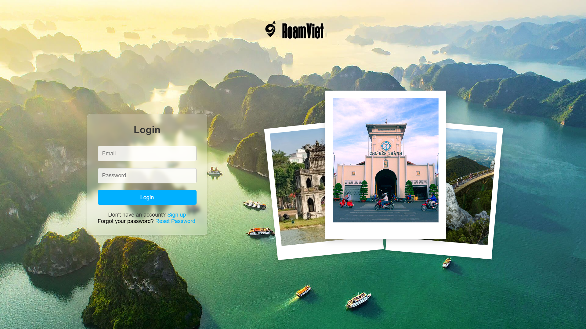
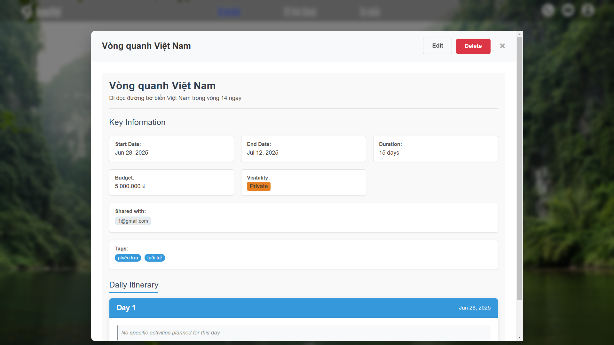

# 🧭 RoamViet

**RoamViet** is a tourism platform designed to promote travel and hospitality services across Vietnam's diverse provinces and cities.

It serves as an intelligent, centralized knowledge hub for both domestic and international travelers seeking to explore Vietnam. With RoamViet, users can discover the country's top attractions without spending hours researching — everything is organized, curated, and ready to explore.

RoamViet also allows groups of friends to plan shared travel schedules, collaborate in real-time, and preserve memorable moments throughout their journey.

---

## 🚀 Features

- 🔐 Firebase Authentication for secure user access
- 📡 Cloud Firestore for real-time data storage
- ⚙️ Modular, scalable backend with FastAPI
- 🖥️ Responsive and intuitive user interface

---

## 🛠️ Tech Stack

| Layer    | Technology                             |
| -------- | -------------------------------------- |
| Frontend | HTML / CSS / JavaScript                |
| Backend  | FastAPI, Firebase (Python SDK)         |
| Database | Firebase Firestore                     |
| Hosting  | Vercel (frontend), ngrok (API tunnels) |

---

## 🖼️ Gallery

Here's a glimpse into RoamViet:

**Landing Page**

**Main Page**

**Scheduling Feature**

**Destination Details**

---
